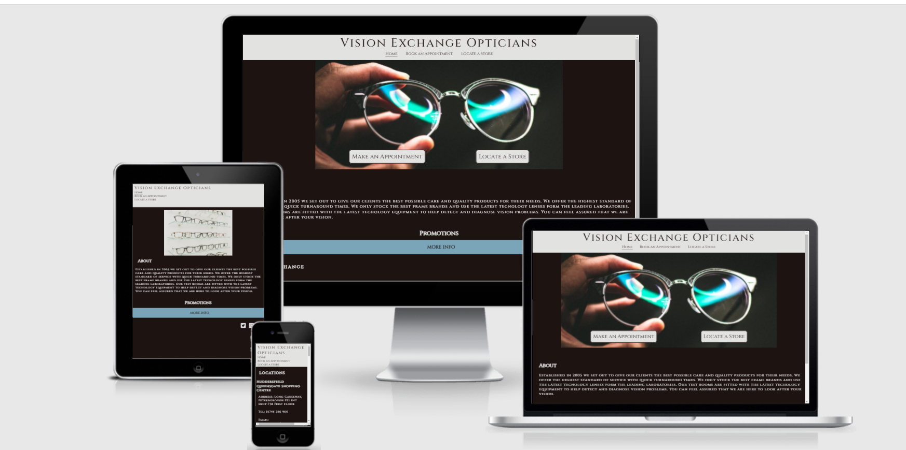
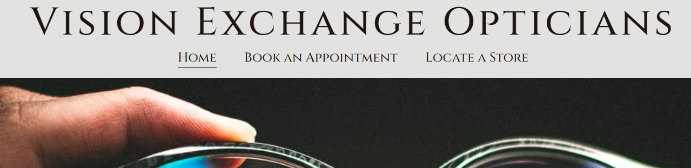
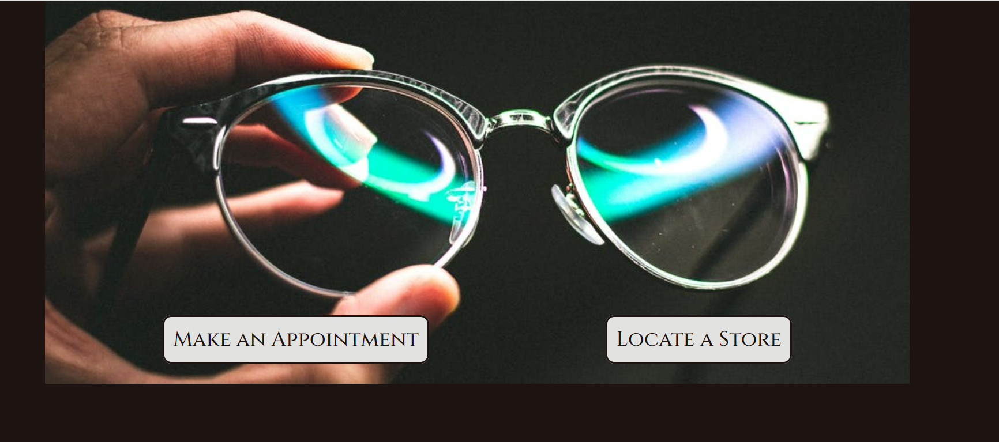
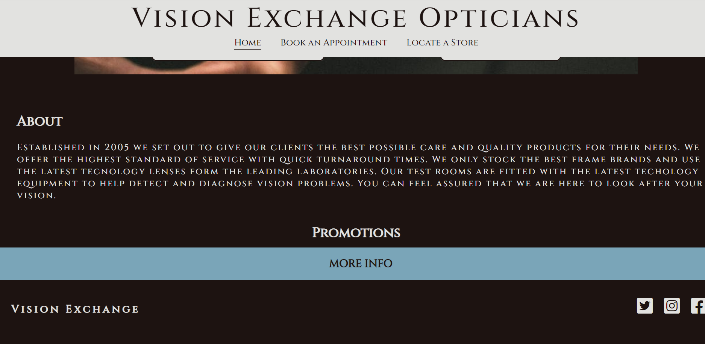
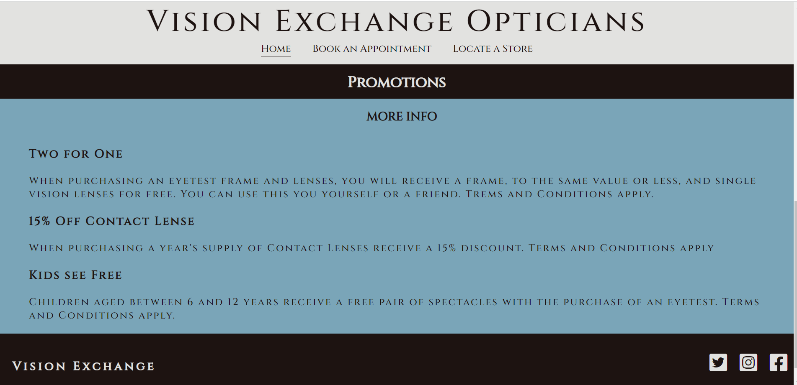
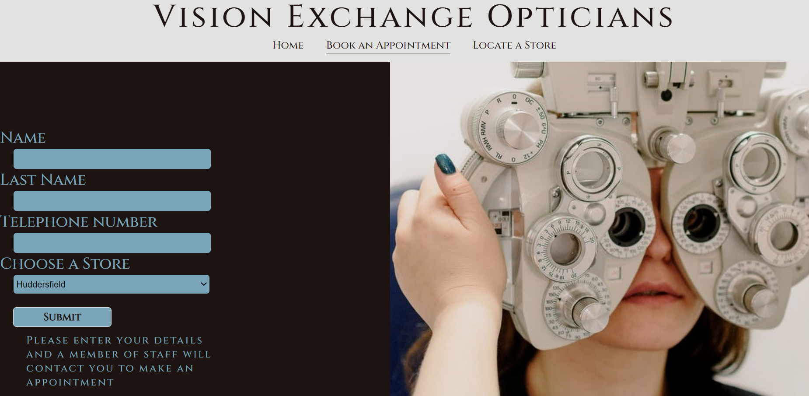
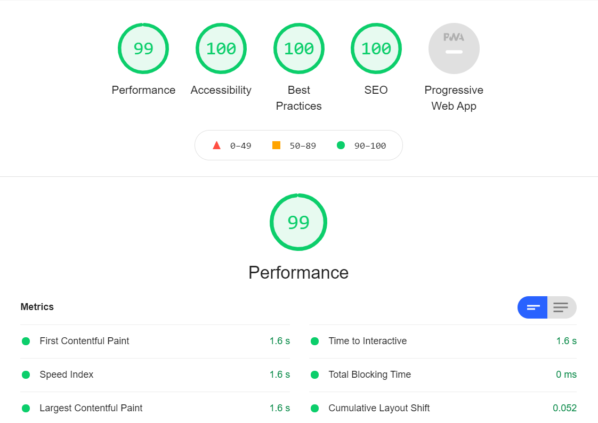

# Vision Exchange Opticians
Vision Exchange opticians wanted a website for their customers to locate them easily and also get more information about their business. They are located in the West Yorkshire are with multiple branches in four different locations. The website will help the customer locate their nearest branch and will also be able to make an online booking request. It provides information about the latest promotions in store and also locations, times and contact details. This website is for anyone that wants to have their eyes tested at an optician or to gather more information about the business.

## Features

### Header and Navigation bar
- The header is fixed to the top of the page and contains the heading and the navigation bar. This is on each page of the website.
- The navigation bar has a home, book an appointment and locate a store links and is centered.
- The font is all capitalized as it would be on a vision acuity chart in a test room. 
- The light grey color was chosen to increase contrast.
- The header was fixed with the elderly in mind that might on be very confident using technology. It will help them to locate the information they need and if they explore the website they will never get lost as the links are always there.
- The navigation bar links will be underlined to show the user on which page they are currently.
 

### Main image and Links
- The main image is a picture of a man inspecting a pair of spectacles. It is chosen to convey that Vision Exchange opticians takes pride in the products they sell and the service they give.
- Two more links were added to reinforce the idea of making a appointment to have your eyes tested.
- The links has a hover effect to show the customer it is a link.

### About Section
- The about section explains the vision and philosophy of Vision Exchange Opticians.
- The way in which they think about there customers and the service they want to deliver.

### Promotions
- The promotions section has a drop down section to hide the information. 
- it was used to keep the home page clean  and clear of clutter.
- the more info has a hover effect to show it is a link.
- If a customer is interested in the promotions available they can just click on the more info link and it will drop down.

### Footer
- At the bottom of each page is the social media links and the name displayed. 
- The name is to the left and the social media links to the right.
- The links has a hover effect to indicate they can be clicked.

### Book an Appointment page
-The Book an Appointment page has the same header, navigation bar and footer as the home page.
- It contains a simple form th fill in if you want to make an appointment.
- Name, Surname and telephone number is required.
- To the left of the  from is an image of a customer getting an eye test. Just to reinforce the idea of having an eye test again.

### Locate a Store page
- This page again has the same header, navigation bar and footer to make it familiar to the customer
- Each location has an address, contact number, email address, opening hours and a google map to locate the store.
- The maps has a link that will open on a new page.

### Testing
- The website was tested on Google Chrome, Microsoft Edge, Firefox and Safari.
- The website is responsive and works on different size devices.
- The form on the Book an Appointment page requires input and the button works
- All the links in the navigation bar and the links int he main image and the social media links work. 

### Bugs
- Making the page responsive to smaller screens showed a problem with the main image. It was to wide and a different image was used to fit the screen better. 
- The image on the book an appointment page was interfering with the contract of the from and it was not legible. The image is hidden on smaller screens

### Validator testing
#### HTML 
- No error were found passing it through the W3C Validator
#### CSS
- No errors were found passing it through the Jigsaw(W3C) Validator.
#### Accessibility 
- Colors and fonts are easy to read used Lighthouse for test in devtools.

### Unfixed Bugs
- There are no unfixed bugs.
 ### Deployment
 - Github pages was used to deploy the page page
 - In the repository scroll down to the Github pages section.
 - Select the main branch from the dropdown menu and select the root directory and save

### Credits
#### Content
- The code for the collapsible on the home page was used from https://www.digitalocean.com/community/tutorials/css-collapsible by Alligator.io
#### Media
- Images were taken from Pexels